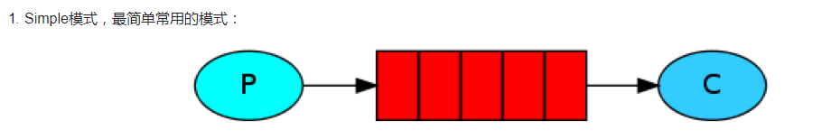
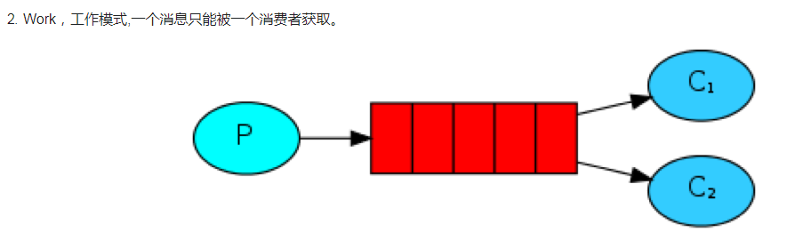
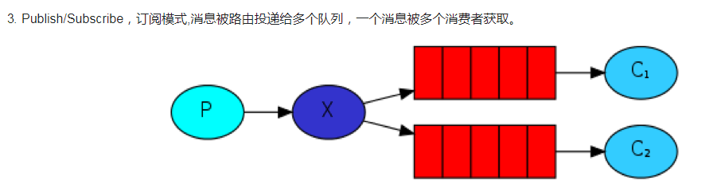
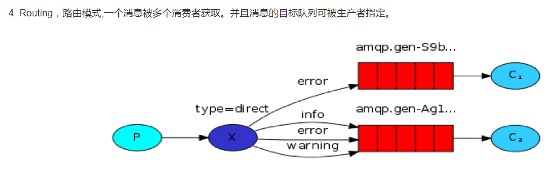
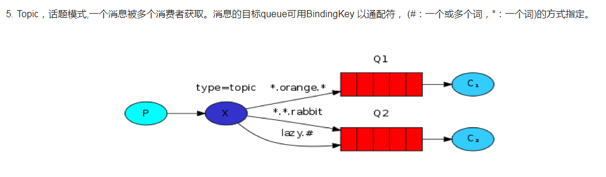

# rabbitMQ_demo
# https://www.cnblogs.com/guokezhiren/p/9197656.html
win7下安装方法：
一、下载资源
Rabbit MQ 是建立在强大的Erlang OTP平台上，因此安装Rabbit MQ的前提是安装Erlang。
1、OTP 23.2 Windows 64-bit Binary File
下载地址 ：http://www.erlang.org/downloads
2、rabbitmq-server-3.7.0.exe
下载地址 ：http://www.rabbitmq.com/install-windows.html

配置环境变量：
1.新建系统变量：
变量名：ERLANG_HOME，变量值：E:\go\rabbitMQ\erl-23.2
2.在环境变量path后面追加：;%ERLANG_HOME%\bin;
3.安装rabbitMQ后，cd到\rabbitmq_server-3.8.9\sbin 目录，开启后台管理插件rabbitmq_managemen，命令为：
rabbitmq-plugins enable rabbitmq_management
rabbitmq-plugins list 查看所有插件
rabbitmq-plugins disable rabbitmq_management 插件卸载
4.启动rabbitmq ：rabbitmq-server start
5.浏览器输入http://localhost:15672即可访问，默认账户和密码都是guest
6.查看rabbitmq状态：rabbitmqctl status，rabbitmq-server stop，rabbitmq-server start
7.安装go rabbitmq：go get github.com/streadway/amqp

工作模式介绍：
1.simple模式，最简单常用的模式：
  生产者（Producer）->rabbitmq->消费者(consumer)
  
2.工作模式，一个消息只能被一个消费者获取。(相对于simple模式，多了消费端而已)
  生产者（Producer）->rabbitmq->消费者1,2,3,4(consumer1,2,3,4)
  使用场景：生产消息的速度大于消费消息的速度时，起到负载作用。
  
3.Publish/Subscribe，订阅模式：消息被路由投递给多个队列，一个消息被多个消费者消费
  生产者（Producer）->exchange->rabbitmq1,2,3->消费者(consumer)
  
4.Routing模式：路由模式，一个消息可以被多个消费者获取，并且消息的目标队列可以被生产者指定
  在订阅模式的基础上，将exchange的kind改为direct，并且指定key
  
5.topic模式：话题模式，一个消息可以被多个消费者获取。
  消息的目标queue可以用bindingKey以通配符,(#:一个或多个词，*:一个词)的方式指定。
  